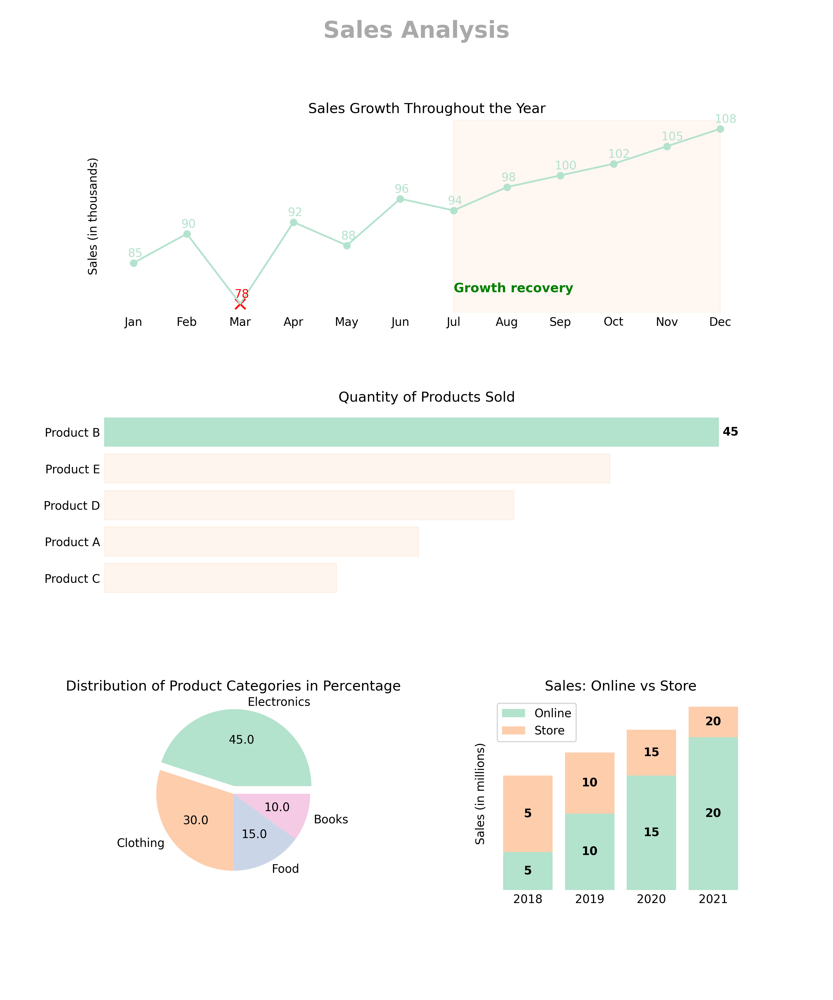
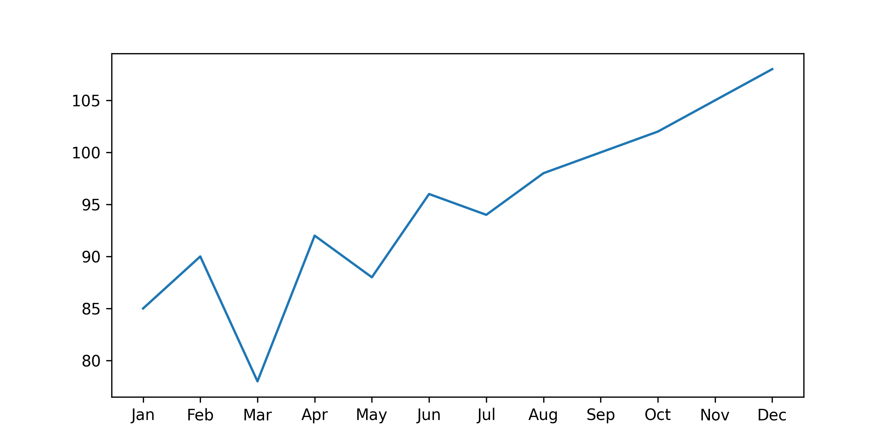
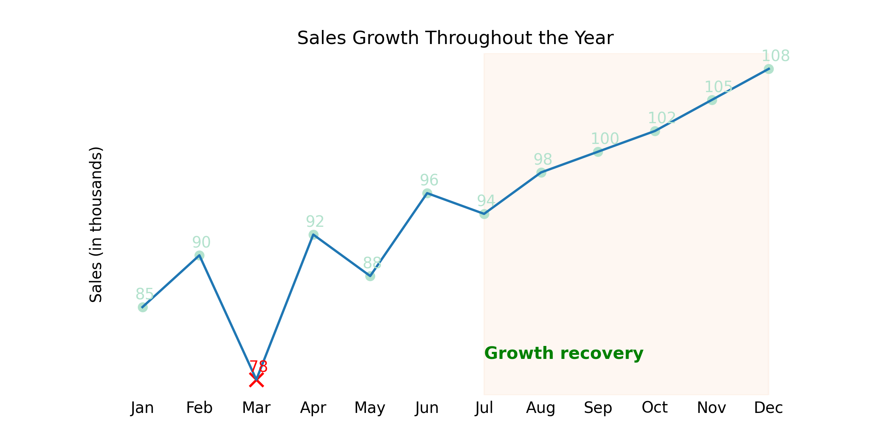
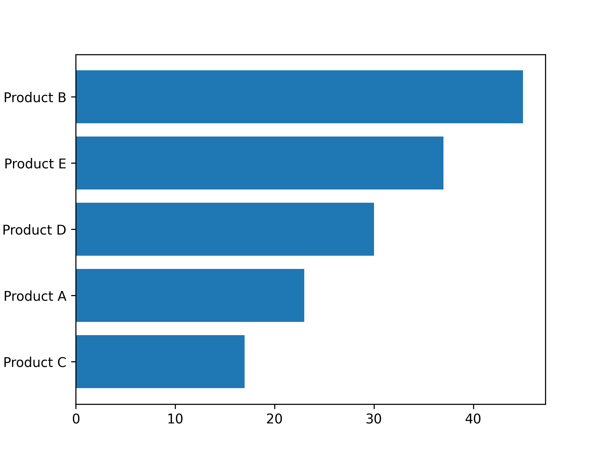
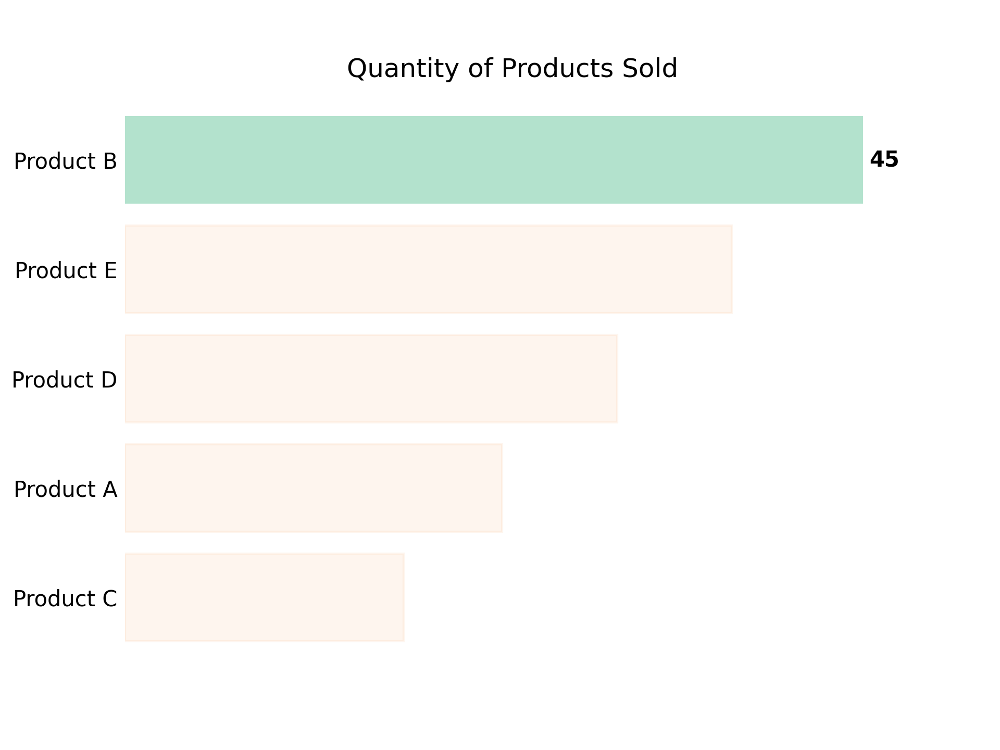
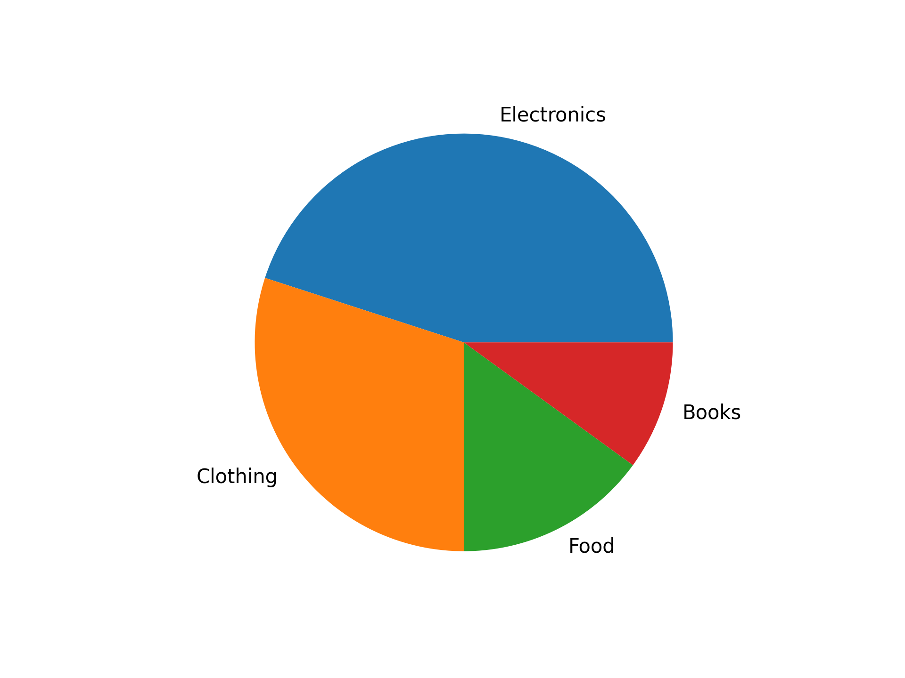
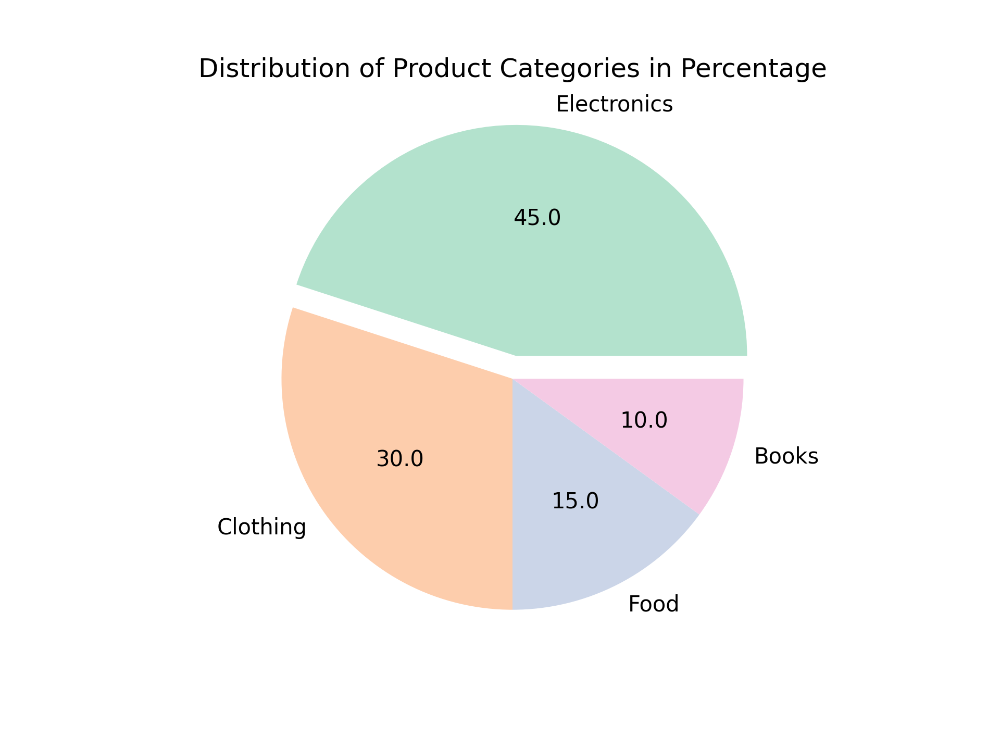
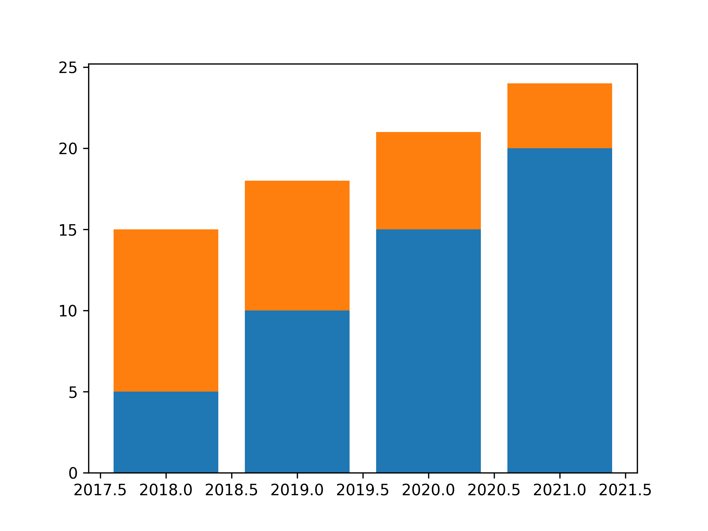
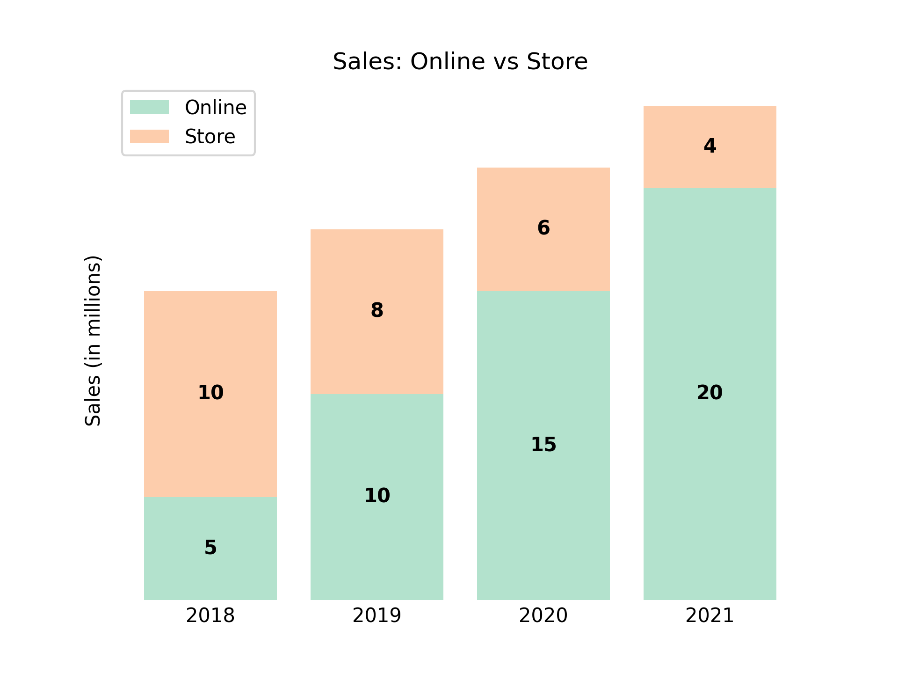

# Data Visualization Project: Creating a Mosaic for Professional Presentations

The main goal of this project is to **highlight how we can improve graph visualization**, focusing on making it more professional, user-friendly, and clearer for both experts and non-experts. It is important that everyone involved can understand the data, and simply showing the data is, in most cases, not enough. We need to ensure that the data is presented in a clear, visually appealing way that highlights key parts and excludes elements that do not contribute to the overall understanding. This approach will help make the information more accessible and actionable for all stakeholders.

## Mosaic for Professional Data Visualization

Below is a mosaic showcasing how we can transform raw graphs into visually appealing and easily interpretable data visualizations. This demonstrates my ability to present data in a way that is easier to understand for a wide audience, ensuring clarity and effective communication in professional presentations. Please note that the data used is made-up and was created solely for illustrative purposes.

## Comparing Graphs Before and After Customization

### 1. Line Chart: Highlighting the Range of Months with Sales Starting from July
**Before:**

**After:**

**Explanation:**
In the "After" version of the line chart, a vertical span (`vspan`) is added to highlight the range of months with sales starting from July. Additionally, text is included to further emphasize the specific months of interest. The use of `np.where` allows us to create a list of x markers for the minimum value, differentiating it from the rest of the data. These changes make it easier to pinpoint trends and key periods of sales performance.

---

### 2. Bar Chart: Highlighting the Product with the Highest Sales
**Before:**

**After:**

**Explanation:**
In the "After" version of the bar chart, we highlight the bar representing the product with the highest sales, making it stand out visually. This customization draws immediate attention to the most significant data point, helping viewers quickly grasp which product has the most sales without having to dig into the details.

---

### 3. Pie Chart: Detaching the First Slice and Adding Percentages Inside
**Before:**

**After:**

**Explanation:**
In the "After" version of the pie chart, we detach the first slice to make it stand out. Additionally, percentages are added inside each slice, making the chart more informative and easier to interpret. These adjustments help viewers quickly understand the relative proportions of each category, improving the overall readability of the chart.

---

### 4. Stacked Bar Chart: Forcing Years to Be Displayed as Integers and Adding Labels
**Before:**

**After:**

**Explanation:**
In the "After" version of the stacked bar chart, we ensure that the years are displayed as integers, making the x-axis labels more precise and easier to read. We also add labels to the bars themselves to indicate the exact values, providing a clearer view of the data distribution across different years. These enhancements make the chart more informative and accessible to viewers.

---

By implementing these changes, we can transform basic graphs into clear, professional data visualizations that highlight key insights and make it easier for any audience to understand the underlying data.
